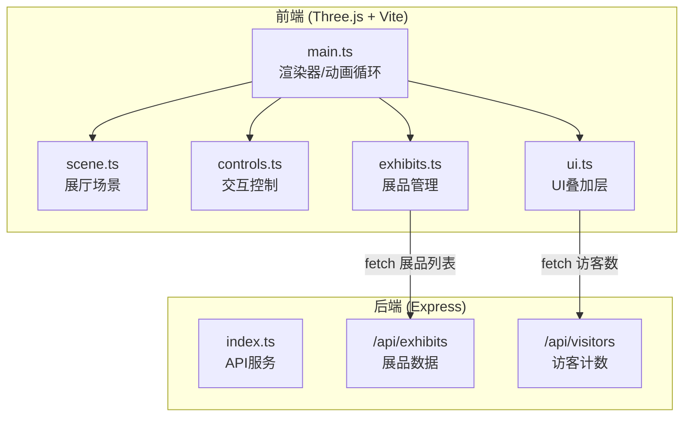

## 1. 架构设计



## 2. 技术说明
- 前端：Three.js + TypeScript + Vite（纯TS，无React）
- 初始化工具：Vite vanilla-ts
- 后端：Express@4 + TypeScript + cors
- 数据库：无，内存Mock数据
- 构建工具：Vite + tsc

## 3. 路由定义
| 路由 | 用途 |
|------|------|
| / | 展厅主页（3D场景） |
| /api/exhibits | 获取展品列表 |
| /api/exhibits/:id | 获取展品详情 |
| /api/visitors | 获取在线访客数 |

## 4. API定义

```typescript
interface Exhibit {
  id: string;
  title: string;
  artist: string;
  dimensions: string;
  description: string;
  imageUrl: string;
  position: { wall: 'north' | 'south' | 'east' | 'west' | 'left-wing' | 'right-wing'; index: number };
}

interface VisitorCount {
  online: number;
  totalExhibits: number;
}

// GET /api/exhibits -> Exhibit[]
// GET /api/exhibits/:id -> Exhibit
// GET /api/visitors -> VisitorCount
```

## 5. 服务器架构

```mermaid
graph LR
    "Express Router" --> "exhibitsRoute"
    "Express Router" --> "visitorsRoute"
    "exhibitsRoute" --> "Mock数据"
    "visitorsRoute" --> "内存计数器"
```

## 6. 数据模型

### 6.1 数据模型定义
无持久化数据库，使用内存Mock数据。展品数据在 server/index.ts 中硬编码。

### 6.2 数据初始化
- 12件展品预置数据（主展厅4幅+两侧廊各4幅）
- 访客计数器启动时初始化，每5分钟重置
