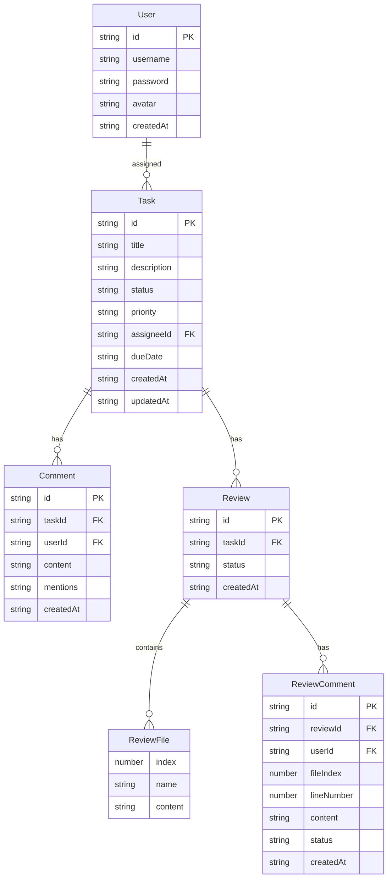

## 1. 架构设计

```mermaid
graph TB
    "React前端(Vite)" --> "Express后端API"
    "Express后端API" --> "内存存储(JSON文件)"
    subgraph "前端"
        "看板页面"
        "详情面板"
        "代码审查页面"
        "统计看板页面"
        "登录注册页面"
    end
    subgraph "后端"
        "用户认证API"
        "任务CRUD API"
        "评论API"
        "代码审查API"
        "统计聚合API"
    end
```

## 2. 技术说明
- 前端：React 18 + TypeScript + Vite + Tailwind CSS + Zustand
- 初始化工具：vite-init (react-express-ts模板)
- 后端：Express 4 + TypeScript (ESM)
- 数据库：内存存储（JSON文件读写模拟）
- 图表：recharts
- 拖拽：@dnd-kit/core + @dnd-kit/sortable
- HTTP客户端：axios

## 3. 路由定义
| 路由 | 用途 |
|------|------|
| /login | 登录/注册页面 |
| /board | 看板主页面（任务卡片拖拽管理） |
| /review | 代码审查页面 |
| /stats | 统计看板页面 |

## 4. API定义

### 4.1 用户认证
- POST /api/auth/register — 注册 { username, password } → { user, token }
- POST /api/auth/login — 登录 { username, password } → { user, token }
- GET /api/users — 获取用户列表 → User[]

### 4.2 任务管理
- GET /api/tasks — 获取所有任务 → Task[]
- POST /api/tasks — 创建任务 { title, description, dueDate, assigneeId, priority } → Task
- PUT /api/tasks/:id — 更新任务 { ...partial Task } → Task
- DELETE /api/tasks/:id — 删除任务 → { success }

### 4.3 评论
- GET /api/tasks/:id/comments — 获取任务评论 → Comment[]
- POST /api/tasks/:id/comments — 添加评论 { content, mentions[] } → Comment

### 4.4 代码审查
- POST /api/reviews — 创建审查 { taskId, files: [{name, content}] } → Review
- GET /api/reviews/:id — 获取审查详情 → Review
- POST /api/reviews/:id/comments — 添加行内评论 { fileIndex, lineNumber, content, status } → ReviewComment
- PUT /api/reviews/:id/status — 更新审查状态 { status } → Review

### 4.5 统计
- GET /api/stats — 获取统计聚合数据 → { totalTasks, completedTasks, overdueTasks, avgCompletionDays, memberStats[], dailyTrend[] }

## 5. 服务端架构图

```mermaid
graph LR
    "Router" --> "Controller"
    "Controller" --> "Service"
    "Service" --> "Store"
    "Store" --> "JSON文件"
```

## 6. 数据模型

### 6.1 数据模型定义



### 6.2 数据定义
- Task.status: "todo" | "in-progress" | "in-review" | "done"
- Task.priority: "urgent" | "high" | "medium" | "low"
- Review.status: "pending" | "approved" | "changes-requested"
- ReviewComment.status: "approved" | "changes-requested"
