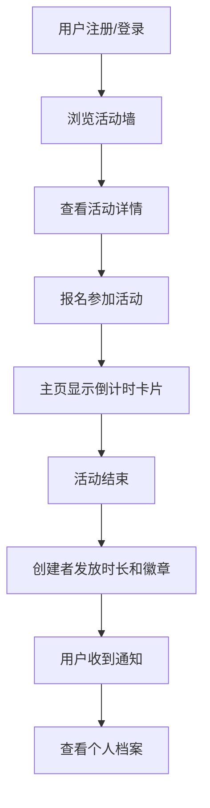

## 1. 产品概述

本应用是一个面向环保志愿者团体的活动管理平台，旨在解决环保活动组织分散、志愿者贡献难以量化和激励不足的问题。通过数字化管理活动、记录参与时长、颁发徽章成就，提升志愿者参与感与组织效率。

- **目标用户**：环保志愿者、活动组织者、社区环保团体
- **核心价值**：活动统一管理、贡献可量化、徽章激励机制

## 2. 核心功能

### 2.1 用户角色

| 角色 | 注册方式 | 核心权限 |
|------|----------|----------|
| 普通用户 | 用户名/密码注册 | 浏览活动、报名参与、查看个人档案 |
| 活动创建者 | 已注册用户自动拥有 | 创建活动、发放时长、颁发徽章 |

### 2.2 功能模块

1. **首页活动墙**：活动卡片列表、搜索筛选、按日期排序
2. **活动详情页**：活动信息展示、报名者列表、报名操作
3. **用户档案页**：时长进度环、徽章网格、活动历史记录
4. **活动创建**：表单填写活动信息、发布活动
5. **徽章系统**：徽章颁发、展示、详情弹窗
6. **通知系统**：实时通知徽章获得、活动状态变更

### 2.3 页面详情

| 页面名称 | 模块名称 | 功能描述 |
|----------|----------|----------|
| 首页 | 活动卡片列表 | 展示所有活动，按日期排序，满员/已结束灰化显示 |
| 首页 | 搜索筛选 | 按活动类型、日期筛选活动 |
| 活动详情页 | 顶部大图区域 | 带渐变遮罩的活动封面图 |
| 活动详情页 | 两栏布局 | 左栏活动详情，右栏报名者头像列表 |
| 用户档案页 | 时长进度环 | SVG动画数字进度环，展示总志愿时长 |
| 用户档案页 | 徽章网格 | 每行4个，悬停翻转显示描述 |
| 用户档案页 | 活动历史 | 倒序排列参与活动记录 |
| 活动创建页 | 表单填写 | 活动名称、地点、时间、描述、招募人数 |

## 3. 核心流程

用户登录后浏览活动墙，选择感兴趣的活动报名；活动开始前主页显示倒计时卡片；活动结束后创建者为参与者发放时长和徽章；用户在个人档案查看累计贡献和成就收藏。

## 4. 用户界面设计

### 4.1 设计风格

- **主色调**：森林绿 #2D6B3B，暖木色 #D4A76A，白色背景
- **卡片风格**：12px圆角，右下方SVG环形进度条，悬停上浮+4px并加深阴影
- **字体**：标题使用 Noto Serif SC 衬线字体，正文使用 Noto Sans SC 无衬线字体
- **徽章风格**：圆形金色边框，带渐变填充，悬停3D翻转效果
- **图标**：使用 lucide-react 图标库，统一线性风格

### 4.2 页面设计概述

| 页面名称 | 模块名称 | UI元素 |
|----------|----------|--------|
| 首页 | 活动卡片 | 森林绿主题，圆角卡片，SVG进度环，状态标签 |
| 首页 | 筛选栏 | 木色背景，圆角标签切换 |
| 活动详情页 | 顶部大图 | 渐变遮罩，大标题叠加 |
| 活动详情页 | 两栏布局 | 左栏详情文字，右栏头像网格 |
| 用户档案页 | 进度环 | SVG圆形动画，数字递增动画 |
| 用户档案页 | 徽章网格 | 4列布局，翻转动画 |
| 徽章弹窗 | 模态框 | 淡入+缩放入场动画 |

### 4.3 响应式

- **桌面端**：活动卡片3列布局，详情页两栏
- **平板端**：活动卡片2列布局
- **移动端**：单列布局，详情页改为垂直堆叠
- 所有交互元素支持触摸操作，按钮最小点击区域44px

### 4.4 动效设计

- 页面加载：元素渐入+上移，错落延迟
- 卡片悬停：上浮+阴影加深，平滑过渡
- 徽章悬停：3D翻转180度显示背面
- 进度环：页面加载时从0开始动画到目标值
- 通知：从顶部滑入，自动消失
- 模态框：淡入+缩放组合动画
