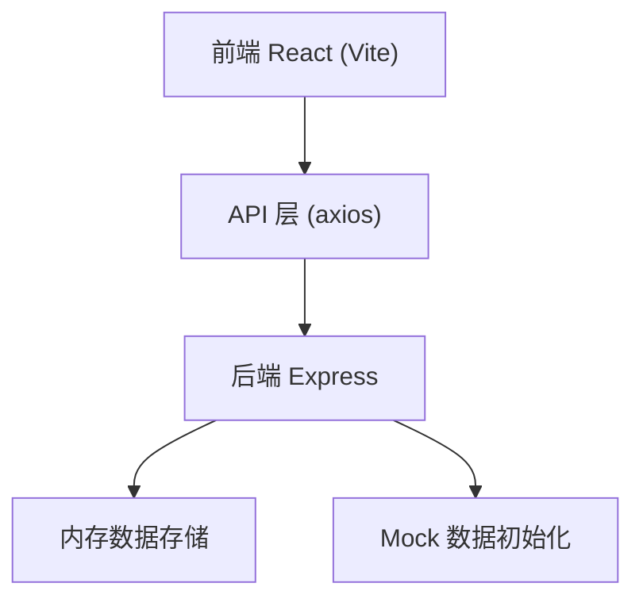
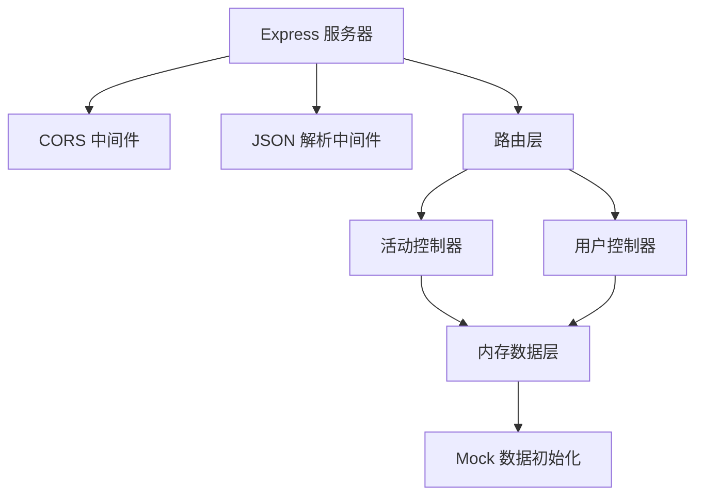
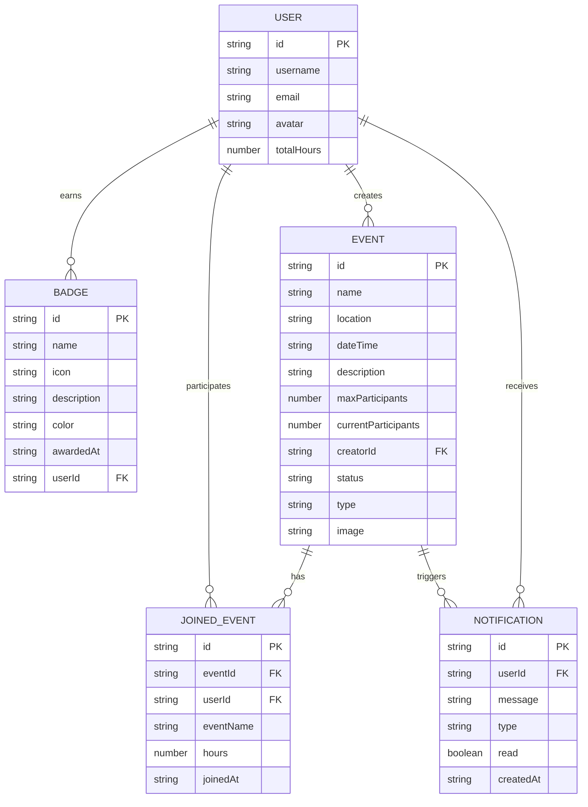

## 1. 架构设计



## 2. 技术描述

- **前端**：React 18 + TypeScript + Vite
- **路由**：react-router-dom v6
- **状态管理**：zustand
- **HTTP 客户端**：axios
- **UI 框架**：Tailwind CSS 3
- **图标**：lucide-react
- **后端**：Express 4 + TypeScript
- **数据存储**：内存存储（使用 uuid 生成 ID）
- **CORS**：cors 中间件

## 3. 路由定义

| 路由 | 页面 | 说明 |
|------|------|------|
| `/` | 首页 | 活动墙，卡片列表展示 |
| `/login` | 登录页 | 用户登录 |
| `/register` | 注册页 | 用户注册 |
| `/event/:id` | 活动详情页 | 活动信息与报名 |
| `/profile` | 用户档案页 | 时长、徽章、历史记录 |
| `/create` | 创建活动页 | 发布新活动 |

## 4. API 定义

### 类型定义

```typescript
interface User {
  id: string;
  username: string;
  email: string;
  avatar: string;
  totalHours: number;
  badges: Badge[];
  joinedEvents: JoinedEvent[];
}

interface Event {
  id: string;
  name: string;
  location: string;
  dateTime: string;
  description: string;
  maxParticipants: number;
  currentParticipants: number;
  participants: string[];
  creatorId: string;
  status: 'upcoming' | 'ongoing' | 'ended';
  type: 'cleanup' | 'planting' | 'education' | 'other';
  image: string;
}

interface Badge {
  id: string;
  name: string;
  icon: string;
  description: string;
  color: string;
  awardedAt: string;
}

interface JoinedEvent {
  eventId: string;
  eventName: string;
  hours: number;
  joinedAt: string;
}

interface Notification {
  id: string;
  message: string;
  type: 'badge' | 'event' | 'system';
  read: boolean;
  createdAt: string;
}
```

### 接口列表

| 方法 | 路径 | 说明 |
|------|------|------|
| GET | `/api/events` | 获取活动列表 |
| GET | `/api/events/:id` | 获取活动详情 |
| POST | `/api/events` | 创建活动 |
| POST | `/api/events/:id/join` | 报名活动 |
| POST | `/api/events/:id/award` | 发放时长和徽章 |
| GET | `/api/users/:id` | 获取用户信息 |
| POST | `/api/users/login` | 用户登录 |
| POST | `/api/users/register` | 用户注册 |
| GET | `/api/users/:id/notifications` | 获取通知列表 |

## 5. 服务端架构



## 6. 数据模型

### 6.1 数据模型定义



### 6.2 项目结构

```
.
├── index.html
├── package.json
├── vite.config.js
├── tsconfig.json
├── src/
│   ├── pages/
│   │   ├── main.tsx
│   │   ├── home.tsx
│   │   ├── profile.tsx
│   │   ├── event-detail.tsx
│   │   ├── login.tsx
│   │   └── create-activity.tsx
│   ├── components/
│   │   ├── EventCard.tsx
│   │   ├── CountdownCard.tsx
│   │   ├── ProgressRing.tsx
│   │   ├── BadgeCard.tsx
│   │   ├── BadgeModal.tsx
│   │   ├── CircularProgress.tsx
│   │   ├── NotificationToast.tsx
│   │   └── Navbar.tsx
│   ├── api/
│   │   └── events.ts
│   ├── store/
│   │   └── useStore.ts
│   ├── hooks/
│   │   └── useVirtualList.ts
│   ├── types/
│   │   └── index.ts
│   └── utils/
│       └── animations.ts
└── backend/
    └── server.ts
```
